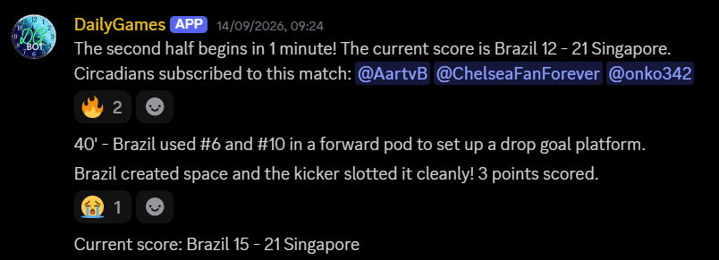

# DailyRugby

A Discord bot for running and managing **DailyRugby** championships, built with **ASP.NET Core** and **Discord.Net**.


## Table of Contents

* [Features](#features)
* [Setup](#setup)
* [About](#about)
* [License](#license)

## Features

DailyRugby is designed to handle an entire rugby championship from Discord, including:

* Create and manage championships.
* Add teams and configure their stats.
* Choose between different season rules.
* Automatically generate championship rounds.
* Schedule and simulate games.
* View standings and championship information.
* Calculate the odds of specific games and championships for use with [DailyBets](https://www.reddit.com/r/dailygames/comments/1tyez7s/dailybets_day_1/).
* Run games live on Discord, with the bot acting as a rugby commentator.

The application uses **SQLite** for data storage. The database is created and migrated automatically when the application starts.

[Back to table of contents.](#table-of-contents)

## Setup

### Requirements

You will need:

* [.NET](https://dotnet.microsoft.com/) installed on your machine.
* A [Discord](https://discord.com/) bot and its token.
* A Discord server where the bot can send messages.

### Installation

1. Clone this repository:

   ```bash
   git clone https://github.com/RafaX9/DailyRugby.git
   cd DailyRugby
   ```

2. Create a Discord bot and obtain its token.

3. Add the bot token to your environment variables using the key:

   ```text
   DailyRugby_Token
   ```

4. Open:

   ```text
   DailyRugby.Web/appsettings.Development.json
   ```

   Set `ServerId` to the ID of the Discord server where the bot will operate, and `ChannelId` to the ID of the channel where it should send game commentary.

   The bot must already be a member of the server and have permission to send messages in the specified channel.

5. Create a Discord role named:

   ```text
   Botbouwer
   ```

   Give this role to yourself and anyone who should be allowed to administer championships.

6. Start the application from the `DailyRugby.Web` directory:

   ```bash
   dotnet run
   ```

That's it. The application automatically creates and migrates the `app.db` SQLite database.

[Back to table of contents.](#table-of-contents)

## About

The story behind this project starts with a Reddit community called [Daily Games](https://reddit.com/r/dailygames), where users create "daily games" that other users play by commenting on posts. A new post is generally made each day, although the exact schedule isn't strict.

There are many different types of daily games. Two examples I particularly like are [DailyDate](https://www.reddit.com/r/dailygames/comments/1wp269m/dailydate_day_469_september_24th_bread_day/) and [Labyrinth](https://www.reddit.com/r/dailygames/comments/1wp1xep/game_1_day_3_labyrinth/).

### The Original DailyRugby

A user named **Aartvb** ([Reddit](https://www.reddit.com/user/Aartvb/) · [GitHub](https://github.com/Aartvb)) created a daily game called [DailyRugby](https://www.reddit.com/r/dailygames/comments/1ts9j6v/dailyrugby_day_0_looking_for_players/).

In the game, players represent countries in a rugby tournament. Each player chooses a country, assigns three attributes (Insight, Physique, and Technique) and chooses a coach. Matches are then simulated based on these choices.

The particularly interesting part was that matches were played out **live on Discord**. Aartvb created a bot using [discord.py](https://discordpy.readthedocs.io/en/stable/) that simulated the game and narrated the events in the community's Discord server, effectively acting as a rugby commentator.

Here's an example of the original bot providing live commentary:



### Why I Built This

The original bot eventually ran into some technical limitations.

A memory leak could cause it to run out of RAM during a game. To work around this, Aartvb implemented a mechanism that restarted the bot when memory usage reached a certain threshold and then resumed the game from where it had stopped.

The bot was also difficult to expand. Creating a new season required substantial changes to the code, and some game-related changes required manually modifying the database.

As a high school student learning ASP.NET Core, I saw this as an opportunity to build my own implementation and try to solve these problems.

### My Implementation

This project moves much of the championship management into the application itself.

Instead of having to manually modify the database or create large amounts of season-specific code, administrators can manage championships through the bot.

The application separates the general championship logic from the rules used by individual seasons. Each season can therefore have its own game simulator while sharing the same championship-management infrastructure.

The long-term goal is to make it possible to introduce new seasons without having to rebuild the entire application around them.

This version is planned to be used for **DailyRugby's fourth season**.

[Back to table of contents.](#table-of-contents)

## License

Copyright (c) 2026 RafaX9

Permission is hereby granted, free of charge, to any person obtaining a copy of this software and associated documentation files (the “Software”), to deal in the Software without restriction, including without limitation the rights to use, copy, modify, merge, publish, distribute, sublicense, and/or sell copies of the Software, and to permit persons to whom the Software is furnished to do so, subject to the following conditions:

The above copyright notice and this permission notice shall be included in all copies or substantial portions of the Software.

THE SOFTWARE IS PROVIDED “AS IS”, WITHOUT WARRANTY OF ANY KIND, EXPRESS OR IMPLIED, INCLUDING BUT NOT LIMITED TO THE WARRANTIES OF MERCHANTABILITY, FITNESS FOR A PARTICULAR PURPOSE AND NONINFRINGEMENT. IN NO EVENT SHALL THE AUTHORS OR COPYRIGHT HOLDERS BE LIABLE FOR ANY CLAIM, DAMAGES OR OTHER LIABILITY, WHETHER IN AN ACTION OF CONTRACT, TORT OR OTHERWISE, ARISING FROM, OUT OF OR IN CONNECTION WITH THE SOFTWARE.

[Back to table of contents.](#table-of-contents)